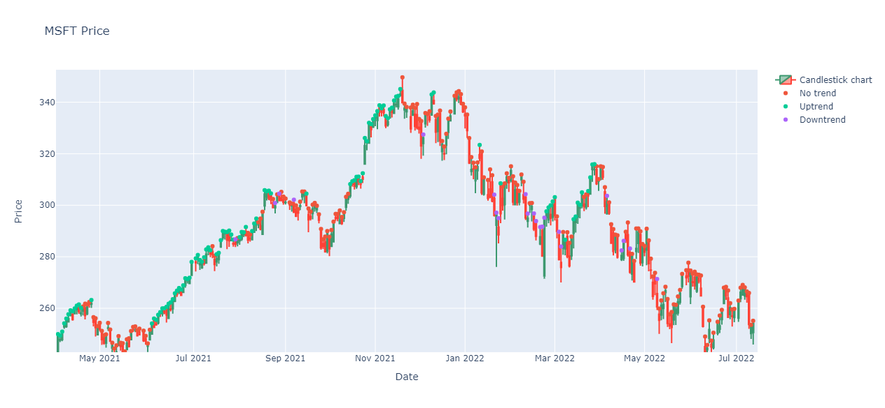
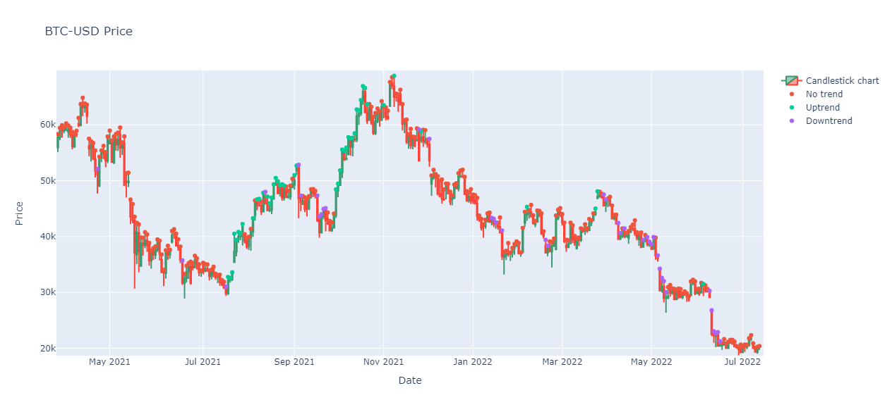

# stock_market_trend_detector

**TL;DR**: The objective from the code in this repo is to create a very simple bidirectional-LSTM classifier to deduce stock market trends algorithmically (without any technical/fundamental analysis).

The three components of this repo are as follows (these are described further below):
1. A data classifying dashboard to manually label data.
2. A NN trainer, which pre-processes all the classified data and trains the LSTM model.
3. A visualisation tool which classifies the entire time series of a financial instrument, and displays as an interactive plotly figure. This is used to judge how effective the classifier is.

## The data classifying dashboard
This simple dashboard has been created in the very intuitive streamlit package to perform the following tasks
- Display the financial instrument's candlestick chart projected forward n days (default is 60)
- Highlight the area of classification
- Allow the user to classify the selected area as 'uptrend', 'downtrend', or 'no-trend'
- After selection of the trend, this is appended to a .csv file in `data/classified/`, and the next n days are displayed

Here is how the dashboard looks, for the start of MSFT's life:

### To use the dashboard
I personally run any streamlit dashboard from the anaconda prompt using the command `streamlit run data_collector.py` (ensure you are running the prompt from the root directory).

## The NN trainer
After classifying some data, the script `train_nn.py` can be run to both generate the input data, and train the LSTM network (you can select either/both). Hopefully the options are clear, but if not, please get in touch! The only option that may cause some confusion is the `days back` parameter, quite simply, this is how many days back from the present day the LSTM has to check (i.e. it may look at the last 30 days to classify the trend of the instrument).

The data is preprocessed by finding **returns** from the previous day, i.e. the time-series of the inputs are given as r = p_t/p_{t-1} - 1; this normalises the input data. The features are as follows:
1. The OLHC data
2. The volume data
3. Candlestick thickness (difference between open/close, high/low)
4. The 10, 20, and 50 day simple moving averages

**Note**: TSLA and AAPL have already been classified, and are included here in this repo. Clearly, there is some discretion with this classification, so you may agree/disagree with what I have done! Perhaps re-classifying will yield better results for you!

**Double note**: I have already trained the LSTM for 50 epochs on Google colab, the saved model is included in this repo.

The following confusion matrix was produced from the small-data and little training:

Here 0 = no trend, 1 = uptrend, and 2 = downtrend

## The visualisation tool + results
After training the model, you can configure and run `visualise.py` which produces an interactive plotly figure in your browser. Here are some results:

### Observations
1. The classifier appears to do rather well for uptrends, but struggles with downtrends (misclassifying with no-trend)
2. There is some choppiness with the predictions, perhaps a rolling average of the classifier will yeild a better result.
3. I think the MSFT chart looks better classified than BTC-USD, this is likely because the classifier was trained on two S&P500 stocks; bitcoin may be a confusing asset and the LSTM has not seen anything similar.

### Next steps and improvements
1. **More data!** - the LSTM needs more examples from different assets to classify better
2. **Longer training** - after #1 is done, longer training is required so the LSTM has time to better learn the differences
3. **Better feature engineering** - perhaps better feature engineering can be performed to help the LSTM differentiate between trends, perhaps using the MACD + other techincal indicators.
4. **Even out the classes** - more-often than not, the stock is in a no-trend stage. Once #1 is completed and more examples are found, the number of examples in each class that the LSTM sees should be equal. I did not include this for now due to the lack of data.
